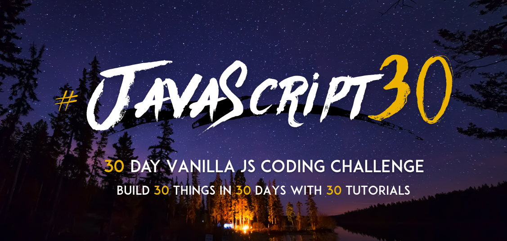

# JavaScript30 - One month vanilla JS challenge

> A personal exploration of [JavaScript30](https://javascript30.com/) challenges created by [Wes Bos](https://github.com/wesbos).

## What's Included:

* 30 days of fun coding challenges.
* Built entirely with Vanilla JavaScript (no frameworks, no compilers, no boilerplate, and no libraries).
* [Showcase](https://gherbetto.github.io/JavaScript30/)

## Resources:
* [Starter Files](https://github.com/wesbos/JavaScript30) – Get started with the original files.

**Thank you for visiting!**
